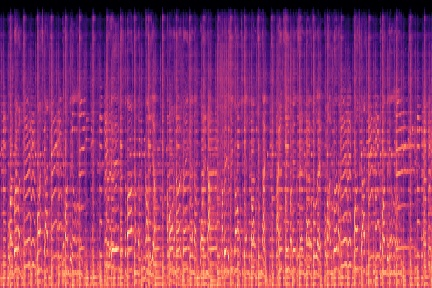
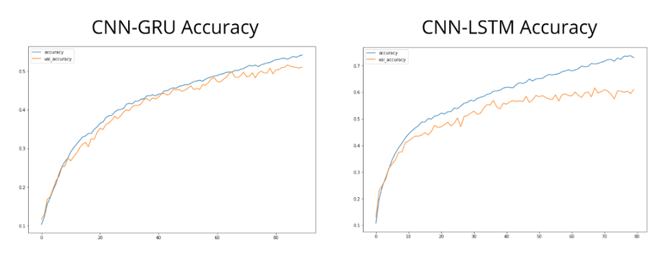

# Music Genre Recogniton

This project is about classifying the genre of a song by using machine learning approach. The neural network used in this code is made up of CNN and LSTM. When compared this model with CNN-GRU, the CNN-LSTM approach performed better than the traditional CNN-GRU approach. The testing has been done on GTZAN dataset.


## Dataset

For this project I have used the GTZAN dataset. This dataset has 1000 audio track and each is 30 sec long. This dataset consists of 10 genres. Download GTZAN [here](http://opihi.cs.uvic.ca/sound/genres.tar.gz).
It has the following genres:
* blues
* classical
* country
* disco
* hiphop
* jazz
* metal
* pop
* reggae
* rock

## Built With
* Python3
* Keras (running tensorflow in the backend)
## How it works
First I take each song from each genre one by one. To make a training set from audio files I convert audio files to their [mel-spectograms](https://en.wikipedia.org/wiki/Mel-frequency_cepstrum). Mel-spectogram of an audio file may look like this:



I divided my dataset into three parts:
```
dataset = training set + test set + valid set
```
After converting to mel-spectogram this result is fed into the neural network structure of CNN-LSTM. The structure output is like below: 
```
Model: "sequential_115"
_________________________________________________________________
Layer (type)                 Output Shape              Param #   
=================================================================
conv2d_223 (Conv2D)          (None, 60, 169, 20)       520       
_________________________________________________________________
max_pooling2d_109 (MaxPoolin (None, 30, 84, 20)        0         
_________________________________________________________________
conv2d_224 (Conv2D)          (None, 26, 80, 50)        25050     
_________________________________________________________________
max_pooling2d_110 (MaxPoolin (None, 13, 40, 50)        0         
_________________________________________________________________
flatten_103 (Flatten)        (None, 26000)             0         
_________________________________________________________________
dense_127 (Dense)            (None, 20)                520020    
_________________________________________________________________
lambda_50 (Lambda)           (None, 20, 1)             0         
_________________________________________________________________
lstm_101 (LSTM)              (None, 512)               1052672   
_________________________________________________________________
dense_128 (Dense)            (None, 10)                5130      
=================================================================
Total params: 1,603,392
Trainable params: 1,603,392
Non-trainable params: 0
```
## Libraries Used
* librosa -> details [here](https://librosa.github.io/librosa/).
* csv
* pandas
* numpy

## Accuracy and Loss Plot
CNN-GRU accuracy = *50.30%*, and

CNN-LSTM accuracy = *~61%*

The CNN-LSTM VS CNN-GRU plot is like below:



## References

* Recommending music on Spotify with deep learning https://benanne.github.io/2014/08/05/spotify-cnns.html
* K. Choi, G. Fazekas, K. Cho, and M. Sandler, “A tutorial on deep learning for music information retrieval,” arXiv preprint arXiv:1709.04396, 2017.
* Music Genre Recognition by Deep Sound http://deepsound.io/music_genre_recognition.html
* Using CNN and RNN for genre recognition by Medium https://towardsdatascience.com/using-cnns-and-rnns-for-music-genre-recognition-2435fb2ed6af 
* K. Choi, G. Fazekas, M. Sandler, and K. Cho, “Convolutional recurrent neural networks for music classification,” in Proc. Int. Conf. Acoust, Speech, Signal Process., 2017 
* Librosa on github - https://github.com/librosa/librosa


